<p align="center">
  
</p>

<h1 align="center">Tribe Up</h1>

<p align="center">
  <strong>A Tribe-Based Social Media Platform — Where Communities Thrive</strong>
</p>

<p align="center">
  
  
  
  
  
  
  
</p>

<p align="center">
  <a href="#-demo">🎬 Live Demo</a> •
  <a href="#-features">✨ Features</a> •
  <a href="#-architecture">🏛 Architecture</a> •
  <a href="#-tech-stack">🛠 Tech Stack</a> •
  <a href="#-getting-started">🚀 Getting Started</a> •
  <a href="#-screenshots">📱 Screenshots</a>
</p>

---

## 📖 About

**Tribe Up** is a fully-featured, tribe-based social media mobile application built with Flutter. Unlike traditional social platforms, Tribe Up introduces the concept of **"Tribes"** — community-driven groups where members collaborate, share posts, stories, and polls, compete on leaderboards, and communicate through **real-time group chat** powered by SignalR.

This is a **Graduation Project** designed and developed with production-grade code quality, clean architecture, and modern software engineering best practices.

---

## 🎬 Demo

<!-- 🔗 ADD YOUR DEMO LINK HERE -->
> **📹 Video Demo:** [Watch the full walkthrough on YouTube / Google Drive](#)

---

## 📱 Screenshots

### 🔐 Authentication
<p align="center">
  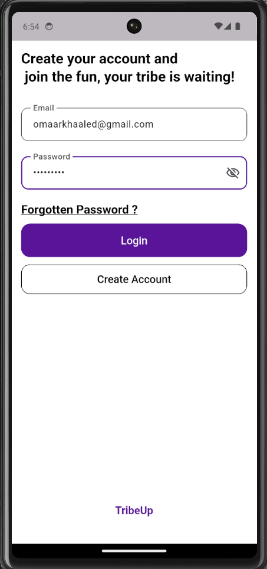
  &nbsp;&nbsp;
  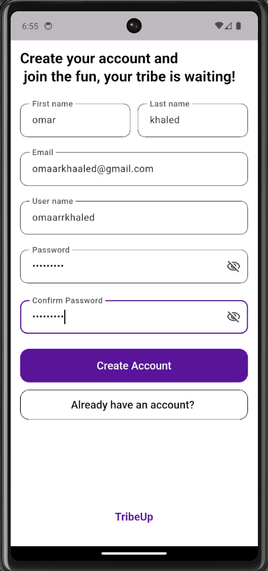
  &nbsp;&nbsp;
  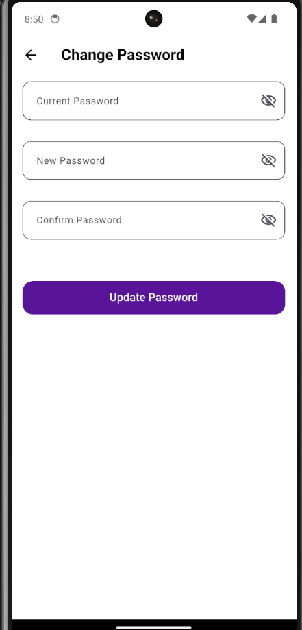
</p>

### 📰 Feed & Stories
<p align="center">
  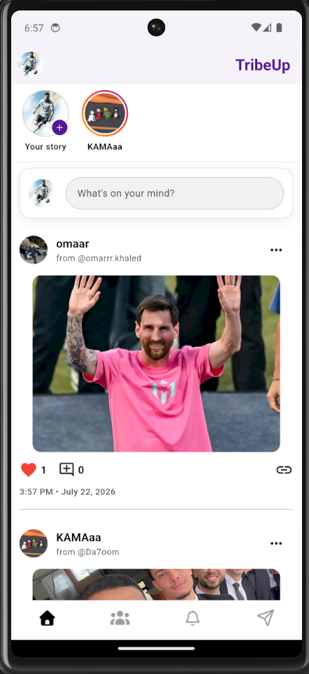
  &nbsp;&nbsp;
  
</p>

### 👥 Tribes
<p align="center">
  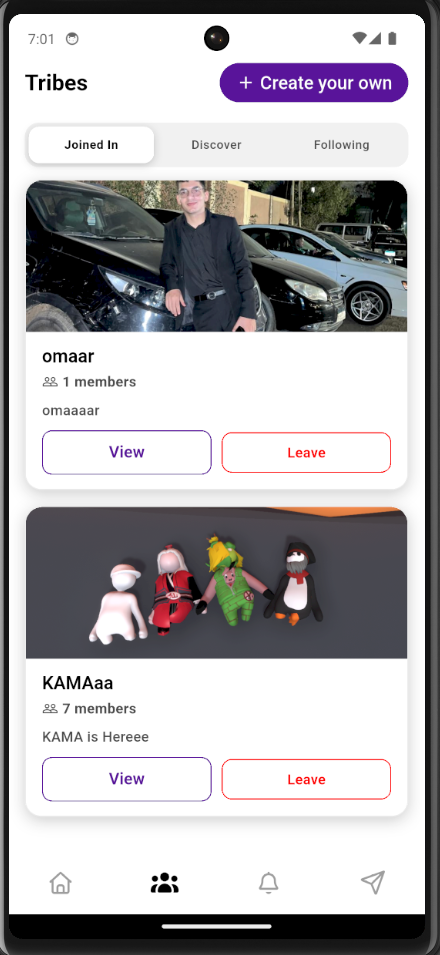
  &nbsp;&nbsp;
  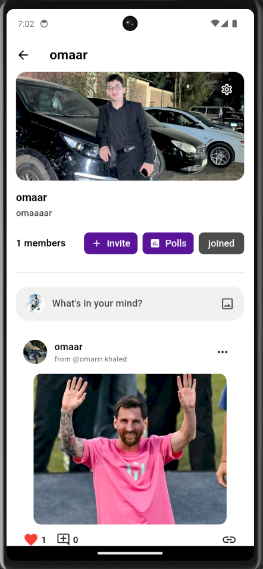
</p>

### 💬 Real-Time Chat
<p align="center">
  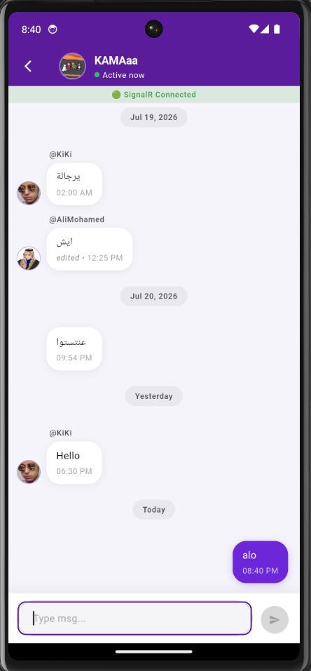
</p>

### 📊 Polls & 🏆 Leaderboard
<p align="center">
  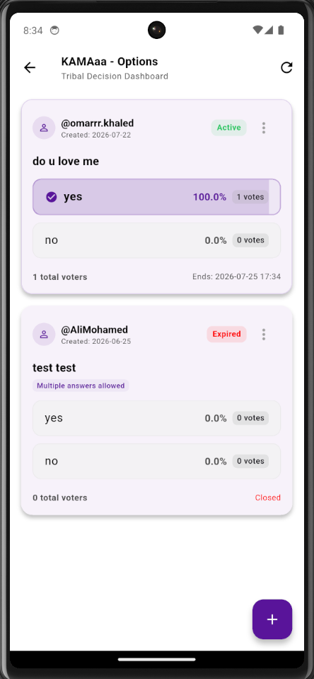
  &nbsp;&nbsp;
  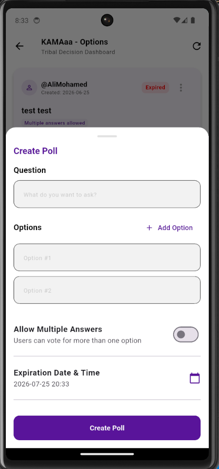
  &nbsp;&nbsp;
  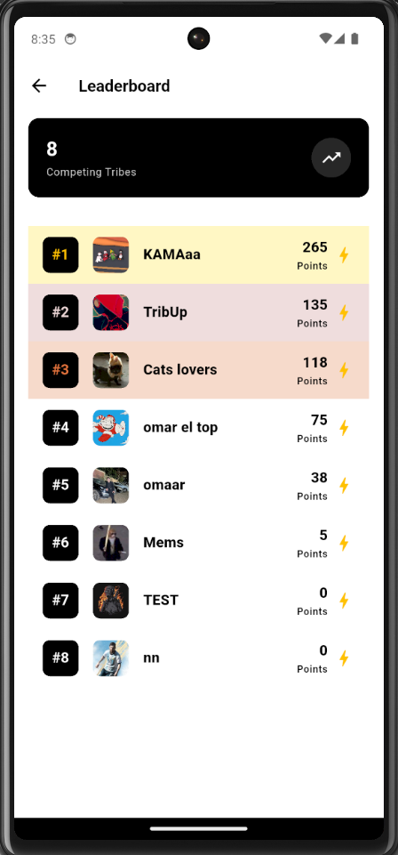
</p>

### 🔔 Notifications
<p align="center">
  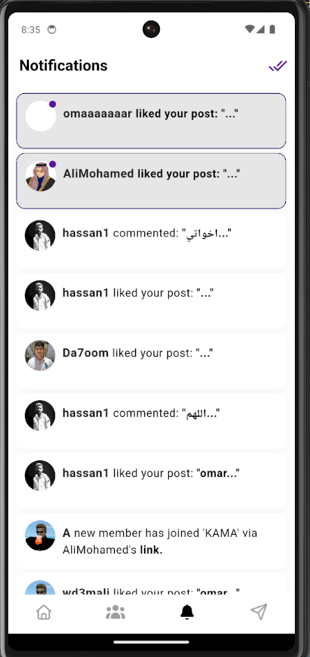
</p>

### 👤 Profile
<p align="center">
  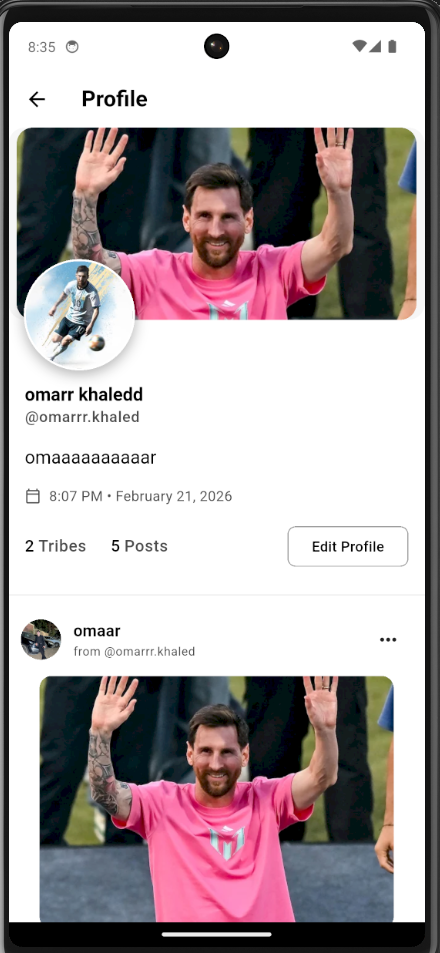
  &nbsp;&nbsp;
  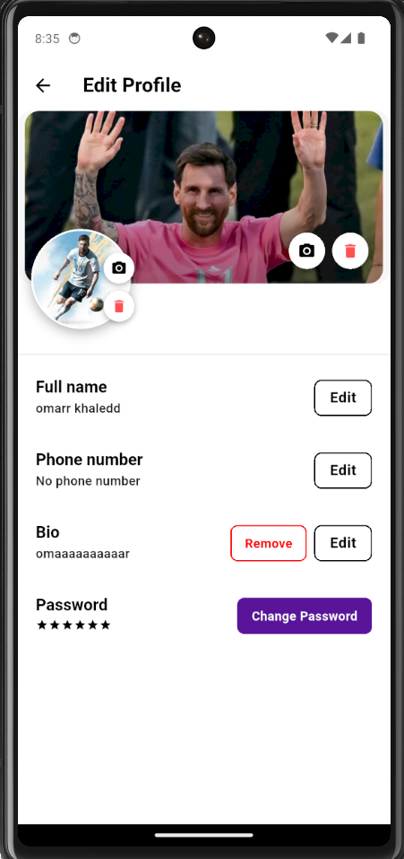
</p>


---

## ✨ Features

### 🔐 Authentication & Security
- **Login & Sign Up** with form validation and email verification (OTP via Pinput)
- **Forgot Password** flow with email recovery
- **Change Password** from settings
- **JWT-based Authentication** with automatic token refresh via Dio interceptor
- **Secure Token Storage** using `flutter_secure_storage` + Hive encrypted box
- **Device ID Management** for multi-device session control
- **Route Guards** — protected & unprotected routes with `GoRouter` redirect logic

### 📰 Feed System
- **Personalized Feed** — aggregated posts from all joined tribes
- **Group-specific Feed** — view posts scoped to a specific tribe
- **Create Post** — rich post creation with text, images, and video attachments
- **Edit & Delete Posts** — full CRUD with ownership validation
- **Like / Unlike** toggle on posts
- **Post Detail View** with deep-link support from notifications
- **Video Player** — inline video playback with caching
- **Expandable Text** — smart text truncation with "Read more"
- **Pull-to-Refresh** & infinite scroll pagination
- **Shimmer / Skeleton Loading** for premium UX

### 📸 Stories
- **Create Stories** — share image/video stories within tribes with optional captions
- **Story Viewer** — full-screen, Instagram-style story viewer with:
  - Animated progress bars per story
  - Tap left/right to navigate, long-press to pause
  - Swipe down to dismiss
  - Auto-advance to next tribe's stories
- **Mark as Viewed** tracking
- **Delete own stories** with confirmation dialog
- **Stories Bar** — horizontal scrollable tribe story feed with unviewed indicators

### 👥 Tribes (Groups)
- **Create Tribe** — name, description, category, privacy settings, and picture
- **Tribe Profile** — cover photo, description, members, followers, posts, and settings
- **Explore Tribes** — discover public tribes to follow
- **My Tribes / Followed Tribes** — organized tab-based navigation
- **Tribe Settings** — edit name, description, picture; manage privacy; delete tribe
- **Member Management:**
  - View all members with role badges (Owner / Admin / Member)
  - **Promote** member to Admin
  - **Demote** admin back to Member
  - **Kick** members from the tribe
  - **Leave Group** option
- **Follower System:**
  - Toggle follow/unfollow on any tribe
  - View followers list
  - Remove followers (for tribe admins/owners)
- **Invitation System:**
  - Generate shareable invitation links with expiry
  - View active invitations
  - Accept invitations via deep link token
  - Revoke active invitations

### 💬 Real-Time Group Chat
- **SignalR WebSocket** connection for instant messaging
- **Send, Edit, Delete** messages in real time
- **Chat Inbox** — unified list of recent conversations with last message preview
- **Message Bubbles** — distinct styling for sent vs. received messages
- **Auto-reconnect** with exponential backoff (`0s → 2s → 5s → 10s → 30s`)
- **Join/Leave Group** room management via SignalR hub
- **Connection Status Banner** (debug mode) — live SignalR status indicator
- **Infinite Scroll** — paginated message history loading
- **Search** within chat inbox

### 📊 Polls
- **Create Poll** — multi-option polls within tribes
- **Vote / Unvote** — toggle vote on poll options
- **View Results** — real-time vote counts and percentages
- **Edit & Delete Polls** — full CRUD for poll creators
- **Polls by Group** — browse and manage polls per tribe

### 🏆 Leaderboard
- **Global Tribe Ranking** — tribes ranked by activity/engagement score
- **Competing Tribes Counter** — total tribes in competition
- **Pull-to-Refresh** for live updates
- **Styled Entry Rows** — rank badges, tribe avatars, and scores

### 🔔 Real-Time Notifications
- **SignalR-Powered Notifications** — instant push via WebSocket hub
- **In-App Notification Banner** — overlay banner with tap-to-navigate
- **Notification Center** — full list with read/unread status
- **Mark as Read** — individual or mark-all-as-read
- **Smart Routing** — tapping a notification navigates to the relevant post/comment
- **Skeleton Loading** during fetch

### 👤 Profile
- **My Profile / Other User Profile** — dynamic routing by username
- **Cover Photo & Profile Picture** — upload, crop (custom image cropper), and delete
- **Edit Name, Bio, Phone** — inline edit sheets
- **Personal Posts Feed** — all posts by the user
- **Settings Screen** — change password, manage account

### 🎨 UI / UX Excellence
- **Custom Theme System** — centralized `AppTheme` with `ColorManager`
- **Google Fonts** integration for premium typography
- **Lottie Animations** — welcome screen, loading indicators
- **Shimmer & Skeletonizer** — polished loading states across all screens
- **Cached Network Images** — `CachedNetworkImage` + `FlutterCacheManager`
- **Sliding Drawer** — custom animated side menu with user summary
- **Animated App Bar** — hides/shows on scroll direction
- **Bottom Navigation Bar** with 4 tabs: Feed, Groups, Notifications, Chat
- **Premium Toast Messages** with `FlutterToast`
- **FontAwesome Icons** for rich iconography

---

## 🏛 Architecture

Tribe Up follows **Clean Architecture** principles with a strict separation of concerns across every feature module:

```
┌──────────────────────────────────────────────────────────┐
│                    Presentation Layer                     │
│          (Screens · Widgets · Cubits/BLoC)               │
├──────────────────────────────────────────────────────────┤
│                      Domain Layer                        │
│           (Entities · Use Cases · Repositories)          │
├──────────────────────────────────────────────────────────┤
│                       Data Layer                         │
│      (Models · Data Sources · API Clients · Repos)       │
├──────────────────────────────────────────────────────────┤
│                    Core / Config Layer                    │
│   (DI · Routing · Network · Services · Theme · Utils)    │
└──────────────────────────────────────────────────────────┘
```

### Design Patterns Used

| Pattern | Implementation |
|---------|---------------|
| **Clean Architecture** | Feature-first modular structure with `api/`, `data/`, `domain/`, `presentation/` layers |
| **BLoC / Cubit** | Reactive state management with intent-driven architecture |
| **Repository Pattern** | Abstracts data sources behind domain-level contracts |
| **Dependency Injection** | `get_it` + `injectable` with auto-generated DI config |
| **Intent Pattern** | Cubits receive typed intent objects instead of raw method calls |
| **UI Intent Stream** | One-shot UI side-effects (toasts, dialogs, navigation) via separate stream |
| **Interceptor Pattern** | Dio `AuthInterceptor` for automatic token injection & refresh |
| **Singleton Services** | SignalR services as lazy singletons for shared real-time connections |
| **Code Generation** | `retrofit_generator`, `json_serializable`, `injectable_generator`, `flutter_gen` |

---

## 📂 Project Structure

```
lib/
├── main.dart                          # App entry point
├── app.dart                           # MaterialApp.router configuration
│
├── config/
│   ├── base_response/                 # Generic API response wrappers
│   ├── base_state/                    # Base state classes for BLoC
│   ├── di/                            # Dependency injection (get_it + injectable)
│   └── dio_modules/                   # Dio client configuration & modules
│
├── core/
│   ├── bloc/                          # Global cubits (AuthCubit)
│   ├── constants/                     # API, routes, UI, date constants
│   ├── enums/                         # App-wide enums
│   ├── errors/                        # Custom exceptions & failures
│   ├── network/                       # Auth interceptor, API call helpers
│   ├── resources/                     # Color & asset managers
│   ├── routing/                       # GoRouter config with guards
│   ├── services/signalr/             # SignalR services (chat + notifications)
│   ├── utils/                         # Theme, validators, UI utilities
│   └── widgets/                       # Shared widgets (notification banner)
│
├── features/
│   ├── auth/                          # Login, Sign Up, Forgot/Change Password
│   │   ├── api/                       # Retrofit API client
│   │   ├── data/                      # Models, data sources (local + remote)
│   │   ├── domain/                    # Entities, repos, 6 use cases
│   │   └── presentation/             # Cubits, screens, widgets
│   │
│   ├── feed/                          # Feed, posts, post detail
│   │   ├── api/                       # Retrofit API client
│   │   ├── data/                      # Models, data sources
│   │   ├── domain/                    # Entities, repos, 7 use cases
│   │   └── presentation/             # Feed cubit, screens, widgets
│   │
│   ├── comments/                      # Post comments system
│   │   ├── api/                       # Retrofit API client
│   │   ├── data/                      # Models, data sources
│   │   ├── domain/                    # Entities, repos, 5 use cases
│   │   └── presentation/             # View model, widgets
│   │
│   ├── story/                         # Tribe stories
│   │   ├── api/                       # Retrofit API client
│   │   ├── data/                      # Models, data sources
│   │   ├── domain/                    # Entities, repos, 5 use cases
│   │   └── presentation/             # Story cubit, viewer, widgets
│   │
│   ├── groups/                        # Tribes (groups) — the core feature
│   │   ├── api/                       # Retrofit API client
│   │   ├── data/                      # Models, data sources
│   │   ├── domain/                    # Entities, repos, 28 use cases
│   │   │   ├── use_cases/groups/      # CRUD, explore, leaderboard (10)
│   │   │   ├── use_cases/group_chat/  # Messaging (5)
│   │   │   ├── use_cases/group_invitations/ # Invite system (5)
│   │   │   ├── use_cases/group_members/     # Member mgmt (5)
│   │   │   └── use_cases/group_followers/   # Follower system (3)
│   │   └── presentation/             # View models, screens, 30+ widgets
│   │
│   ├── polls/                         # In-tribe polls & voting
│   │   ├── api/                       # Retrofit API client
│   │   ├── data/                      # Models, data sources
│   │   ├── domain/                    # Repos, 6 use cases
│   │   └── presentation/             # View model, screens, widgets
│   │
│   ├── notification/                  # Real-time notifications
│   │   ├── api/                       # Retrofit API client
│   │   ├── data/                      # Models, data sources
│   │   ├── domain/                    # Entities, repos, 3 use cases
│   │   └── presentation/             # View model, screens, widgets
│   │
│   └── profile/                       # User profile & settings
│       ├── api/                       # Retrofit API client
│       ├── data/                      # Models, data sources
│       ├── domain/                    # Entities, repos, 14 use cases
│       └── presentation/             # View model, screens, 9 widgets
│
├── gen/                               # flutter_gen generated asset references
└── l10n/                              # Localization (prepared for i18n)
```

---

## 🛠 Tech Stack

### Framework & Language
| Technology | Purpose |
|-----------|---------|
| **Flutter 3.x** | Cross-platform mobile framework |
| **Dart 3.9+** | Programming language with null safety & pattern matching |

### State Management & Architecture
| Package | Purpose |
|---------|---------|
| `flutter_bloc` / `bloc` | Reactive state management (Cubit pattern) |
| `equatable` | Value equality for state classes |
| `get_it` | Service locator for dependency injection |
| `injectable` / `injectable_generator` | Compile-time DI code generation |
| `go_router` | Declarative routing with redirect guards |

### Networking & Real-Time
| Package | Purpose |
|---------|---------|
| `dio` | HTTP client with interceptors |
| `retrofit` / `retrofit_generator` | Type-safe API client generation |
| `signalr_netcore` | Real-time WebSocket communication (chat + notifications) |
| `jwt_decoder` | JWT token parsing and validation |
| `pretty_dio_logger` | Network request/response logging |

### Data & Storage
| Package | Purpose |
|---------|---------|
| `hive` / `hive_flutter` | Lightweight local database for token & cache |
| `flutter_secure_storage` | Encrypted secure storage |
| `shared_preferences` | Simple key-value persistence |
| `cached_network_image` / `flutter_cache_manager` | Image caching with placeholder support |
| `json_annotation` / `json_serializable` | JSON serialization code generation |

### Media & UI
| Package | Purpose |
|---------|---------|
| `video_player` | Inline video playback |
| `audioplayers` | Audio playback support |
| `image_picker` | Camera & gallery image selection |
| `flutter_svg` | SVG rendering |
| `lottie` | Lottie JSON animations |
| `cached_network_image` | Cached network images with shimmer |

### UI Components & Design
| Package | Purpose |
|---------|---------|
| `google_fonts` | Premium typography (Google Fonts) |
| `font_awesome_flutter` | FontAwesome icon library |
| `pinput` | OTP input fields |
| `shimmer` / `skeletonizer` | Loading skeleton animations |
| `percent_indicator` | Circular/linear progress indicators |
| `flutter_easyloading` | Global loading overlay |
| `fluttertoast` | Toast notifications |

### Code Generation & Dev Tools
| Package | Purpose |
|---------|---------|
| `build_runner` | Code generation orchestration |
| `flutter_gen_runner` | Type-safe asset references |
| `retrofit_generator` | API client generation |
| `json_serializable` | Model serialization |
| `injectable_generator` | DI configuration generation |
| `mockito` | Mocking for unit tests |
| `bloc_test` | BLoC/Cubit testing utilities |

### Backend (API)
| Technology | Purpose |
|-----------|---------|
| **ASP.NET Core** | RESTful API backend |
| **SignalR** | Real-time WebSocket hubs (group-chat + notifications) |
| **Azure App Service** | Cloud hosting (UAE North region) |
| **JWT Bearer Tokens** | Authentication & authorization |

---

## 🚀 Getting Started

### Prerequisites

- **Flutter SDK** ≥ 3.x
- **Dart SDK** ≥ 3.9.2
- **Android Studio** / **VS Code** with Flutter extensions
- **Android Emulator** or **iOS Simulator** (or physical device)

### Installation

```bash
# 1. Clone the repository
git clone https://github.com/OmaarKhaaled/tribe_up.git
cd tribe_up

# 2. Install dependencies
flutter pub get

# 3. Run code generators (required for Retrofit, JSON serialization, DI, assets)
dart run build_runner build --delete-conflicting-outputs

# 4. Run the app
flutter run
```

### Running on Specific Platforms

```bash
# Android
flutter run -d android

# iOS (macOS only)
flutter run -d ios

# List available devices
flutter devices
```

---

## 🔑 API & Backend

The app connects to a **live ASP.NET Core backend** hosted on **Azure App Service**:

| Service | Endpoint |
|---------|----------|
| **REST API** | `https://tribe-up-*.azurewebsites.net/api/` |
| **Group Chat Hub** | `wss://tribe-up-*.azurewebsites.net/hubs/group-chat` |
| **Notifications Hub** | `wss://tribe-up-*.azurewebsites.net/hubs/notifications` |

### Key API Modules
- `Authentication` — Login, Register, Refresh, Forgot/Change Password, Logout
- `Posts` — Feed, CRUD, Likes, Group Feed, Content Moderation
- `Comment` — CRUD, Like
- `Story` — Create, Delete, Group Stories, Story Feed, Mark Viewed
- `Groups` — CRUD, Explore, Followed Groups
- `GroupMembers` — Members, Promote, Demote, Kick, Leave
- `GroupInvitations` — Create, Accept, Revoke, Details
- `Group Followers` — Get, Toggle Follow, Delete
- `GroupChat` — Messages, Send, Edit, Delete, Inbox
- `Polls` — CRUD, Toggle Vote
- `Notification` — Get, Read, Read All
- `Leaderboard` — Global Rankings
- `Profile` — Me, Name, Bio, Phone, Avatar, Picture, Cover

---

## 🧪 Testing

The project includes testing infrastructure with:

```bash
# Run all tests
flutter test

# Run with coverage
flutter test --coverage
```

| Tool | Purpose |
|------|---------|
| `flutter_test` | Widget & unit test framework |
| `mockito` | Mock generation for repositories & data sources |
| `bloc_test` | Cubit/BLoC state transition testing |

---

## 👥 Team

This project was developed as a **Graduation Project**.

<!-- 👇 ADD YOUR TEAM MEMBERS HERE -->
<!--
| Name | Role | GitHub |
|------|------|--------|
| Your Name | Flutter Developer | [@username](https://github.com/username) |
| Team Member | Backend Developer | [@username](https://github.com/username) |
-->

---

## 📄 License

This project is developed for educational purposes as a graduation project.

<!-- 👇 ADD YOUR LICENSE INFO HERE IF APPLICABLE -->

---

<p align="center">
  <strong>Built with ❤️ using Flutter</strong>
</p>

<p align="center">
  <sub>If you found this project useful, please consider giving it a ⭐</sub>
</p>
